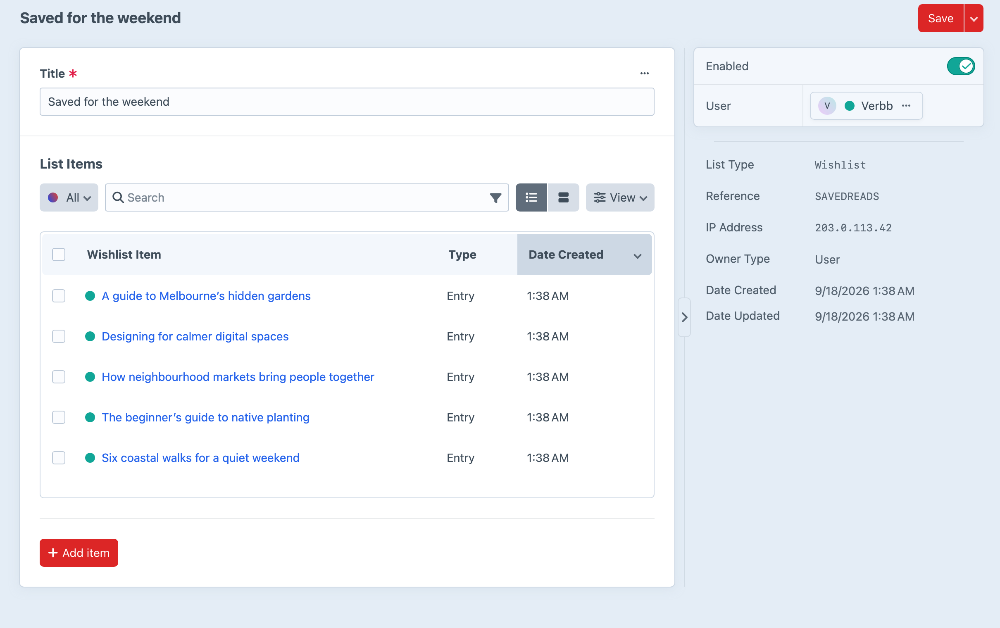

<!-- feature-intro -->
Let visitors create lists for any Craft element. Build favourites for entries, wishlists for products, reading lists or project-specific collections — all shareable through a unique URL.
<!-- feature-intro-end -->

<!-- feature-section media-size="large" -->
## Save now, decide later

Guests and signed-in users can add supported Craft elements to a list. A simple site may use one default list, while list types allow several distinct collection experiences with their own behaviour.

<!-- feature-section-end -->

<!-- feature-section -->
## Member-managed lists

Allow registered users to create, rename, clear, and delete their own lists. Custom fields on lists and items capture notes, quantities, or other context beyond the saved element itself. Ownership checks protect front-end actions, while nominated staff can be given permission to manage another user’s lists.

<!-- feature-section-end -->

<!-- feature-section -->
## Turn saved products into purchases

Add Craft Commerce purchasables from a wishlist to the cart in one action and share a list through its unique URL. The front-end flow remains in project templates, ready to match the store.
<!-- feature-section-end -->
